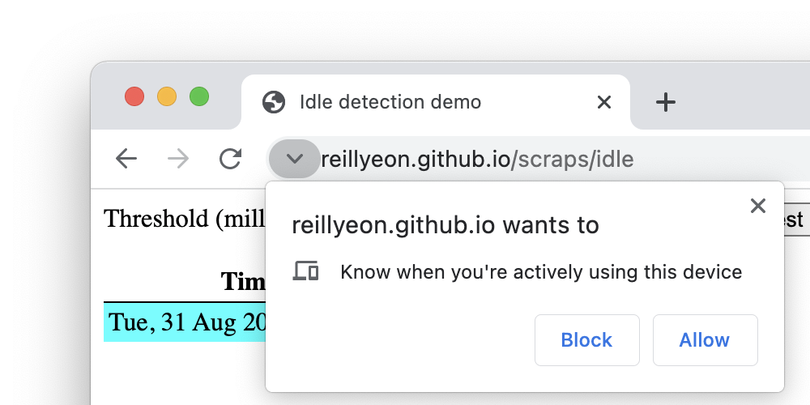
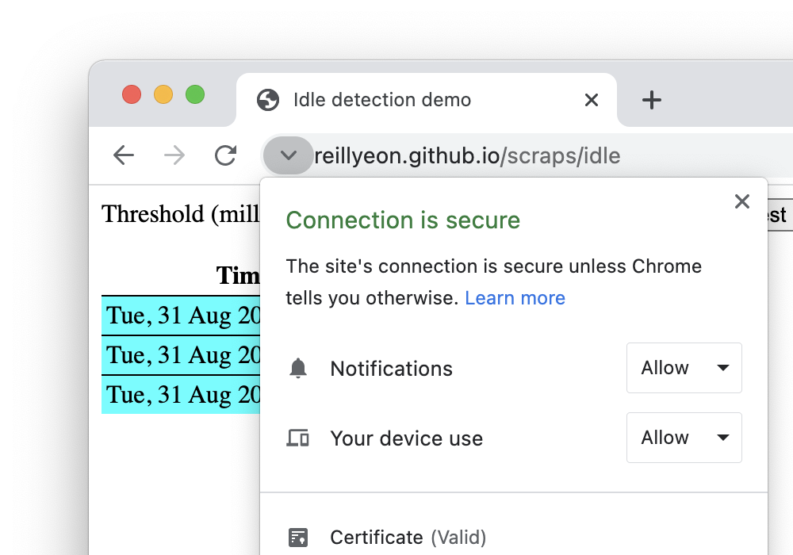

# User Idle Detection

This proposed API allows developers to add an event listener for when the user
becomes idle (e.g. they don’t interact with the keyboard, mouse or touchscreen,
when a screensaver activates or when the screen is locked). Unlike solutions
based on monitoring input events this capability extends beyond the site's
content area (e.g. when users move to a different window or tab).

Native applications and browser extensions (e.g. [Chrome
apps](https://developer.chrome.com/apps/idle), [Android
apps](https://stackoverflow.com/questions/8317331/detecting-when-screen-is-locked),
[Firefox
extensions](https://developer.mozilla.org/en-US/docs/Mozilla/Add-ons/WebExtensions/API/idle),
[Edge
extensions](https://github.com/MicrosoftDocs/edge-developer/blob/master/microsoft-edge/extensions/api-support/supported-apis.md#idle))
use idle detection to notify other users that the user is unreachable (e.g. in
chat applications), to show timely alerts (e.g. "welcome back" when a user
returns to their task) or to pause media (e.g. to save bandwidth when the user
is not present).

The API should provide a means to _detect_ the user's idle status (active, idle,
locked), and a power-efficient way to be _notified_ of changes to the status
without polling from script.

Feedback: [WICG Discourse
Thread](https://discourse.wicg.io/t/idle-detection-api/2959) &mdash;
[Issues](https://github.com/inexorabletash/idle-detection/issues)

## Use cases

* Chat application: presenting a user's status to other users and delivering
  notifications to the device where the user is active.
* Showing timely notifications - e.g. deferring displaying feedback until the
  user returns to an active state.
* Updating an outdated service worker when there's no unsaved state by
  triggering reloading of the tab.

## Relationship with other APIs

* As opposed to the
  [requestIdleCallback](https://www.w3.org/TR/requestidlecallback/), this is
  _not_ about asynchronously scheduling work when the **system** is idle.
* As opposed to the [Page Visibility
  API](https://developer.mozilla.org/en-US/docs/Web/API/Page_Visibility_API),
  this API enables detecting idleness even after a page is no longer visible
  (e.g. after the page is no longer visible, is the user still around? if i
  showed a notification, would it be perceived?).

## Polyfills

Currently, web apps (e.g. Dropbox’s
[idle.ts](https://github.com/dropbox/idle.ts)) are constrained to their own
content area:

1. costly polling for input events or 
1. listening to [visibility
   changes](https://developer.mozilla.org/en-US/docs/Web/API/Page_Visibility_API)

Script can't tell today when a user goes idle outside of its content area (e.g.
whether a user is on a different tab or logged out of the computer altogether).

## Model

The API assumes that there is some level of engagement between the user, user
agent, and operating system of the device in use. This is represented in two
dimensions:

1. The user idle state
  * **active**/**idle** - the user has / has not interacted with the user agent
    for some period of time
2. The screen idle state
  * **locked**/**unlocked** - the system has an active screen lock preventing
    interaction with the user agent

Distinguishing "active" from "idle" requires heuristics that may differ across
user, user agent, and operating system. It should also be a reasonably coarse
threshold (See Privacy).

The model intentionally does not formally distinguish between interaction with
particular content (i.e. the web page in a tab using the API), the user agent as
a whole, or the operating system; this definition is left to the user agent.

> Example: The user is interacting with an operating system providing multiple
> virtual desktops. The user may be actively interacting with one virtual
> desktop, but unable to see the content of another virtual desktop. A user
> agent presenting content on the second virtual desktop may report an "idle"
> state rather than an "active" state.

## API Design

The API design is largely inspired by the [Sensors
API](https://w3c.github.io/sensors). You can find more about alternatives
considered [here](annex.md).

### WebIDL

```js
dictionary IdleOptions {
  [EnforceRange] unsigned long threshold;
  AbortSignal signal;
};

enum UserIdleState {
    "active",
    "idle"
};

enum ScreenIdleState {
    "locked",
    "unlocked"
};

[
  SecureContext,
  Exposed=(Window,DedicatedWorker)
] interface IdleDetector : EventTarget {
  constructor();
  readonly attribute UserIdleState? userState;
  readonly attribute ScreenIdleState? screenState;
  attribute EventHandler onchange;
  [Exposed=Window] static Promise<PermissionState> requestPermission();
  Promise<void> start(optional IdleOptions options = {});
};
```

### Example

Here is an example of how to use it (more detailed instructions
[here](HOWTO.md)):

```js
const main = async () => {
  // Feature detection.
  if (!('IdleDetector' in window)) {
    return console.log('IdleDetector is not available.');
  }
  // Request permission to use the feature.
  if ((await IdleDetector.requestPermission() !== 'granted') {
    return console.log('Idle detection permission not granted.');
  }
  try {
    const controller = new AbortController();
    const signal = controller.signal;
    
    const idleDetector = new IdleDetector();
    idleDetector.addEventListener('change', () => {
      console.log(`Idle change: ${idleDetector.userState}, ${idleDetector.screenState}.`);
    });    
    await idleDetector.start({
      threshold: 60000,
      signal,
    });
    console.log('IdleDetector is active.');
    
    window.setTimeout(() => {
      controller.abort();
      console.log('IdleDetector is stopped.');
    }, 120000);
  } catch (err) {
    // Deal with initialization errors like permission denied,
    // running outside of top-level frame, etc.
    console.error(err.name, err.message);
  }
};

main();
```

## Platforms

All platforms (Linux, Windows, macOS, Android, iOS and Chrome OS) support some
form of idle detection.

On desktop devices (Chrome OS, Linux, macOS and Windows), a screen saver (from a
time when monitors were damaged if the same pixels were lit for an extended
period of time) activates after a user-configurable period of inactivity. The
operating system may optionally require the user to reauthenticate (i.e. lock
the screen) after the screen saver has been activated for a period of time. Both
of these events are observable by engines.

On mobile devices (Android and iOS), the screen is dimmed after a few seconds of
inactivity (to save battery, not pixels) but this isn't observable by engines
(on Android). The screen is eventually turned off (to save further battery) if
the user remains inactive for a configurable amount of time (typically 30
seconds), and that is observable by engines. When the screen goes off, the
screen is also typically locked (unlockable by Swipe, Pattern, PIN or Password),
although it can be configured to be left off but unlocked.

## Permissions

The ability to use this API will be controlled by the new [`"idle-detection"`
permission].

## Security and Privacy

See answers to the W3C TAG's [security & privacy self-review
questionnaire](https://www.w3.org/TR/security-privacy-questionnaire/) in
[security-privacy-self-assessment.md](security-privacy-self-assessment.md).

The idle state is a global system property and so care must be taken to prevent
this from being used as a cross-origin communication or identification channel.
This is similar to other APIs which provide access to system events such as
[Generic Sensors](https://w3c.github.io/sensors/) and
[Geolocation](https://w3c.github.io/geolocation-api/).

A short idle threshold could be used to identify user behavior in another tab.
With a short enough threshold an idle state change could be used to measure
typing cadence when the user is in another application and thus leak sensitive
data such as passwords.

Users with physical or cognitive impairments may require more time to interact
with user agents and content. The API should not allow distinguishing such
users, or limiting their ability to interact with content any more than existing
observation of UI events.

If an implementation restricts the detection threshold it should also restrict
how quickly responses to `start()` are delivered or ensure that the response is
cached or otherwise provide a guarantee that rapid polling does not bypass the
restriction on data granularity.

To mitigate the exposure of this global state the API should be restricted to
top-level frames with a new `"idle-detection"` permission. This permission can
be delegated to sub-frames via [Permissions Policy] or the [`sandbox`
attribute]. The top-level frame requirement significantly reduces the number of
cross-origin contexts which can observe the state event and thus identify the
user through backend communication channels.

Requiring a permission does not completely mitigate the cross-origin
identification issue but further reduces the number of sites which are able to
participate in such an attack.

A new permission informs the user about the permission the page is requesting.

> 
> <br>
> Example icon and text for an `"idle-detection"` permission request.

Rather than expanding the definition of an existing permission, it is clear to
users which sites have access to additional capabilities.

> 
> <br>
> Example page information dialog box showing a site with both
> `"notifications"` and `"idle-detection"` permissions granted.

This capability changes the web privacy model by allowing the site to observe a
limited amount of information about how the user interacts with their device
outside the border of the site's content area. Sites using this permission
should present the request in a context which explains the value to the user of
being granted this capability.

Implementations that provide a "privacy browsing" mode should not enable this
capability in such a mode. This may be satisfied incidentally by not allowing
notification permission to be granted. Care should be taken to avoid allowing
sites to detect this mode by, for example, randomly delaying the automatic
disapproval of the notification permission so that it appears to have been
denied by the user.

## Alternative Permissions Models

### Event Timing Fuzzing

The current idle state and the timing of transitions between states are global
state which could be used to identify a user across origin boundaries. For
example, two cooperating sites could compare the timestamps at which they
observed clients transitioning from `"active"` to `"idle"`. Two clients which
appear to consistently make transitions at the same time have a high likelyhood
of being the same user.

A mitigation with the potential to directly address this attack is to add a
random delay between when the specified threshold is passed and when the
`"change"` event is fired.

This mitigation was considered and determined to be unacceptable because:

* Delaying the event by even a small amount drastically reduces the usefulness
  of the API in chat applications which want to ensure that messages are
  delivered to the correct device.
* Even with a large fuzzing factor (e.g. 30 seconds) data collected over a long
  period of time is still sufficient to identify the user.

### Combined with Notification Permission

Rather than defining a new `"idle-detection"` permission, the definition of the
existing `"notifications"` permission could be expanded to control access to
this capability. The most compelling use cases for this capability involve
messaging applications, so the [`"notifications"` permission] seems
appropriate.

The advantage of not defining a new permission type is that it helps to avoid
"consent fatigue", in which users are presented with an endlessly increasing
number of choices by operating systems, browsers, and web sites. Adding this
capability to a related permission such as `"notifications"` can maintain a
user's control while reducing the number of decisions that need to be made.

The disadvantage of not defining a new permission is that it changes the meaning
of permission decisions the user had made in the past. While notifications are
related to signals of user presence the ability to monitor this state may not be
something the user considers when granting this permission.

There is a middle-ground in which the permission prompt text for the
[`"notifications"` permission] is updated to explain this new capability but
both capabilities are still controlled by a single permission. Implementations
could internally track whether the user has seen the updated prompt and require
a site re-request the [`"notifications"` permission] before it has access to the
new capability.

## Prior Work

* Chrome's [chrome.idle](https://developer.chrome.com/apps/idle) API for
  apps/extensions, which is a direct inspiration for this proposal.
  * Also exposed to Extensions in Firefox
    [MDN](https://developer.mozilla.org/en-US/docs/Mozilla/Add-ons/WebExtensions/API/idle)
  * And
    [Edge](https://github.com/MicrosoftDocs/edge-developer/blob/master/microsoft-edge/extensions/api-support/supported-apis.md#idle)
  * That API has a global (per-execution-context) threshold and one source of
    events. This makes it difficult for two components on the same page to
    implement different thresholds.
* Attempts to do this from JS running on the page:
  * [idle.ts](https://github.com/dropbox/idle.ts) from Dropbox
  * [Idle.js](http://shawnmclean.com/detecting-if-user-is-idle-away-or-back-by-using-idle-js/)

[`"notifications"` permission]: https://w3c.github.io/permissions/#notifications
[Permissions Policy]: https://w3c.github.io/webappsec-permissions-policy/
[`sandbox` attribute]: https://html.spec.whatwg.org/multipage/iframe-embed-object.html#attr-iframe-sandbox
